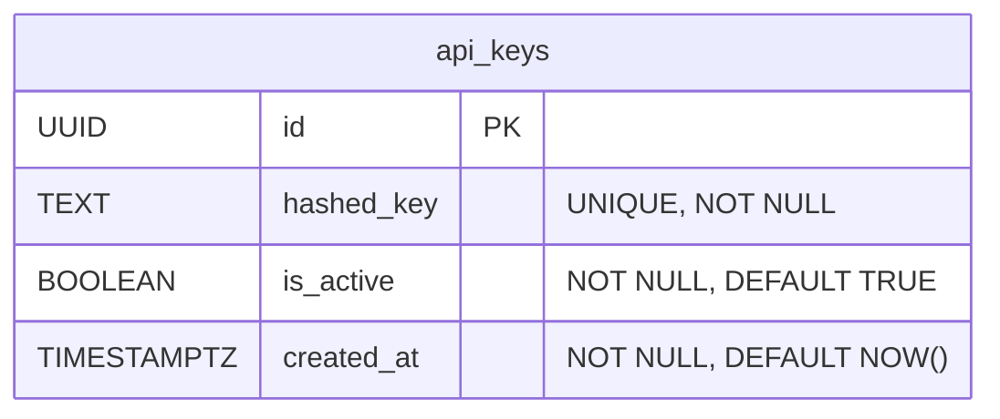

# Data Model: API Key Whitelist Authentication

**Version**: 1.0
**Status**: DRAFT
**Author**: Gemini CLI Agent
**Last Updated**: 2026-02-13

## 1. Overview

This document defines the database schema required to support the API Key Whitelist Authentication feature. The model consists of a single new table, `api_keys`, which will store the necessary information to validate client API keys.

## 2. ERD (Entity Relationship Diagram)



## 3. Table Schemas

### 3.1. `api_keys`

Stores hashed representations of API keys that are authorized to access the service.

*   **Table Name**: `api_keys`

| Column | Data Type | Constraints | Description |
| :--- | :--- | :--- | :--- |
| `id` | `UUID` | `PRIMARY KEY` | The unique identifier for the key record. |
| `hashed_key` | `TEXT` | `UNIQUE`, `NOT NULL` | The SHA-256 hashed value of the client's API key. |
| `is_active` | `BOOLEAN` | `NOT NULL`, `DEFAULT TRUE` | A flag to enable or disable the key without deleting it. |
| `created_at` | `TIMESTAMPTZ` | `NOT NULL`, `DEFAULT NOW()` | The timestamp when the key record was created. |

#### Indexes

*   An index should be created on the `hashed_key` column to ensure fast lookups during the authentication process.
    ```sql
    CREATE INDEX idx_api_keys_hashed_key ON api_keys (hashed_key);
    ```

## 4. Data Rules & Constraints

*   **Uniqueness**: The `hashed_key` must be unique to prevent collisions and ensure that each API key is represented only once.
*   **Security**: Raw API keys must **never** be stored in this table. Only securely hashed representations are permitted.
*   **Activation**: The `is_active` flag provides a mechanism to revoke access for an API key without permanently deleting the record.
