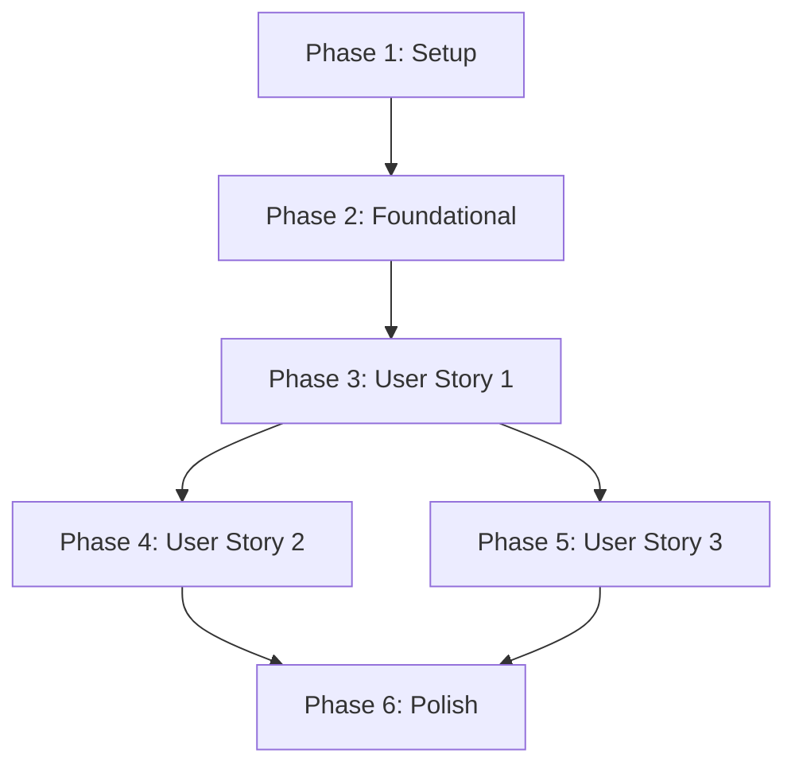

# Task Plan: API Key Whitelist Authentication

**Version**: 1.1
**Status**: PENDING
**Author**: Gemini CLI Agent
**Last Updated**: 2026-02-13

## 1. Overview

This document outlines the development tasks required to implement the API Key Whitelist Authentication feature. The tasks are organized into phases, with each user story treated as an independently testable unit of work. This version updates the test endpoint to `/v1beta/models`.

## 2. Implementation Strategy

The implementation will follow an MVP-first approach, prioritizing the core "happy path" (User Story 1). Subsequent user stories, which cover failure scenarios, will be implemented as extensions of the foundational logic, primarily through the addition of specific integration tests targeting the new endpoint.

## 3. Phases & Tasks

### Phase 1: Setup

*   **Goal**: Prepare the project environment by adding necessary dependencies.
*   **Tasks**:
    - [ ] T001 Add `sha2` and `hex` dependencies to `Cargo.toml`.

### Phase 2: Foundational (Database & Utilities)

*   **Goal**: Create the database schema and essential utilities required for all user stories.
*   **Tasks**:
    - [ ] T002 Create a new SQLx migration file for the `api_keys` table using `sqlx migrate add create_api_keys_table`.
    - [ ] T003 [P] Define the `api_keys` table schema, index, and seed data in the new migration file in `migrations/`.
    - [ ] T004 [P] Create a new utility module and `hash_api_key` function in `src/utils/crypto.rs`.
    - [ ] T005 [P] Create the `/v1beta/models` endpoint module and a placeholder handler in `src/routes/models.rs`.

### Phase 3: User Story 1 - Authenticate with a Valid API Key

*   **Goal**: Implement the core authentication logic for valid API keys.
*   **Independent Test Criteria**: A `GET` request with a valid `x-goog-api-key` header to `/v1beta/models` must return a `200 OK` status.
*   **Tasks**:
    - [ ] T006 [US1] Create the integration test file at `tests/auth_check.rs`.
    - [ ] T007 [US1] Write a failing integration test for the valid key scenario (GET /v1beta/models) in `tests/auth_check.rs`.
    - [ ] T008 [US1] Create the authentication middleware module `src/middleware/auth.rs`.
    - [ ] T009 [US1] Implement the middleware logic to extract the `x-goog-api-key` header.
    - [ ] T010 [US1] Implement the database query logic within the middleware to find the corresponding `hashed_key`.
    - [ ] T011 [US1] Register the `/v1beta/models` route and apply the `ApiKeyAuth` middleware in `src/main.rs`.

### Phase 4: User Story 2 - Fail Authentication with an Invalid API Key

*   **Goal**: Ensure requests with invalid keys are rejected.
*   **Independent Test Criteria**: A `GET` request with an invalid `x-goog-api-key` header to `/v1beta/models` must return a `403 Forbidden` status.
*   **Tasks**:
    - [ ] T012 [US2] Write an integration test for the invalid key scenario in `tests/auth_check.rs`.

### Phase 5: User Story 3 - Fail Authentication with a Missing API Key

*   **Goal**: Ensure requests without API keys are rejected.
*   **Independent Test Criteria**: A `GET` request without an `x-goog-api-key` header to `/v1beta/models` must return a `401 Unauthorized` status.
*   **Tasks**:
    - [ ] T013 [US3] Write an integration test for the missing key scenario in `tests/auth_check.rs`.

### Phase 6: Polish & Verification

*   **Goal**: Ensure code quality, run all checks, and finalize the feature.
*   **Tasks**:
    - [ ] T014 [P] Run `cargo fmt` to format the codebase.
    - [ ] T015 [P] Run `cargo clippy` to check for and fix lints.
    - [ ] T016 Run all tests with `cargo test` to ensure all scenarios pass and there are no regressions.

## 4. Dependencies

*   **User Story 1** is the foundational story and must be completed first.
*   **User Story 2** and **User Story 3** depend on the middleware implemented in User Story 1 but can be developed in parallel with each other.

## 5. Parallel Execution

*   **Phase 2**: Tasks T003, T004, and T005 can be worked on in parallel after T002 is complete.
*   **Phases 4 & 5**: The tests for User Story 2 (T012) and User Story 3 (T013) can be developed in parallel after Phase 3 is complete.
*   **Phase 6**: Tasks T014 and T015 can be run in parallel.
