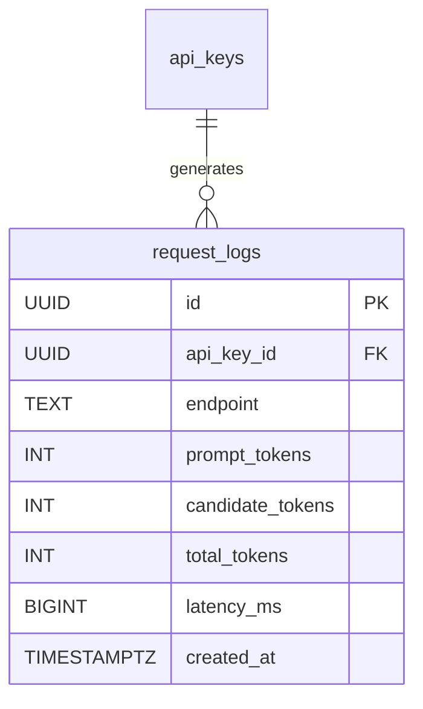

# Data Model: Usage Logging

**Version**: 1.0
**Status**: DRAFT
**Author**: Gemini CLI Agent
**Last Updated**: 2026-02-14

## 1. Overview

This document defines the database schema for tracking API usage statistics.

## 2. ERD



## 3. Table Schemas

### 3.1. `request_logs`

Stores usage metrics for each successful API request.

| Column | Data Type | Constraints | Description |
| :--- | :--- | :--- | :--- |
| `id` | `UUID` | `PRIMARY KEY`, `DEFAULT gen_random_uuid()` | Unique identifier for the log entry. |
| `api_key_id` | `UUID` | `NOT NULL`, `REFERENCES api_keys(id)` | Foreign key linking to the authenticated API key. |
| `endpoint` | `TEXT` | `NOT NULL` | The specific API path accessed (e.g., `/v1beta/models/...`). |
| `prompt_tokens` | `INT` | `DEFAULT 0` | Number of tokens in the input prompt. |
| `candidate_tokens` | `INT` | `DEFAULT 0` | Number of tokens in the generated response. |
| `total_tokens` | `INT` | `DEFAULT 0` | Total token count for the request. |
| `latency_ms` | `BIGINT` | | Total time taken for the request in milliseconds. |
| `created_at` | `TIMESTAMP` | `DEFAULT NOW()` | Timestamp when the log was created. |

#### Indexes

*   Index on `api_key_id` for quick aggregation of usage by key.
*   Index on `created_at` for time-based reporting.

```sql
CREATE INDEX idx_request_logs_api_key_id ON request_logs (api_key_id);
CREATE INDEX idx_request_logs_created_at ON request_logs (created_at);
```
